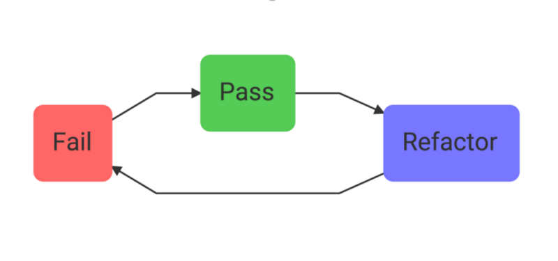
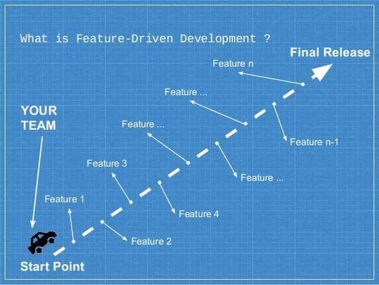

## Вы точно знаете все DD? Погружаемся в мир PDD, HDD, DDD и других!

### Введение
Мотивацией к написанию этой статьи стало великое множество **DD**-подобных аббревиатур.  
Я решил объединить их обзор в одном месте — это может быть полезно как для **собеседований**, так и для **общего развития**.  
Статья не претендует на глубину погружения в каждую методологию, а скорее предлагает поверхностный обзор.
Порой данные методологии являются шуточными (HDD, PDD), порой - весьма основополагающими (DDD, BDD, TDD)
Более того, некоторые из них - антипаттерны (Panic DD, Fear DD)
В связи с этим я привожу их в порядке убывания полезности и серьезности (на мой взгляд)
---  

### 1. **DDD (Domain-Driven Development)**
- Ubiquitous language - вследствие чего легко сопоставлять действия в коде и действия бизнеса
- Bounded Context
- Выделенный домен (аггрегат) - вследствие чего легко тестировать


https://habr.com/ru/companies/dododev/articles/489352/

### 2. **TDD (Test-Driven Development)**
Red -> Green -> Refactor


### 3. **FDD (Fear-Driven Development)**
Mostly fear of changing code: https://www.hanselman.com/blog/fear-driven-development-fdd
Legacy/spaggetti code without tests and static analysis, so nothing holds your back

### 4. **ADD (API-Driven Development)**
Сначала проектируется АПИ (например в виде open api), а потом уже пишется код
Например, когда аналитик создает вам задачу с уже описанным АПИ, 
или когда вы имплементируете чей-то существующий АПИ интерфейс (например работа с пактными менеджерами),
или же если вы договорились с фронтом, что апи будет выглядеть вот так, 
и вы пошли оба пилить, а не ждете один другого

https://techaffinity.com/blog/api-driven-development/

### 5. **BDD (Behavior-Driven Development)**

Эта методология рдилась из Test Driven Development, по большей части предлагает более близкий бизнесу язык написания тестов, 
так что новый член команды может понять систему по тестам, а тесты могут писать даже не программисты (в теории)

```text
Feature: Listing command
  In order to change the structure of the folder I am currently in
  As a UNIX user
  I need to be able to see the currently available files and folders there

  Scenario: Listing two files in a directory
    Given I am in a directory "test"
    And I have a file named "foo"
    And I have a file named "bar"
    When I run "ls"
    Then I should get:
      """
      bar
      foo
      """
```

### 6. **CDD (Comment-Driven Development)**

Методология предлагает разработчику перед решением задачи в коде описать подробный алгоритм действий в виде комментария

Что-то вроде
```php
// разбить строку на массив слов
// создать новый массив
// под ключ ложить слово, под значение - единицу
// если ключ уже существует - прибавлять к значению единицу
// вернуть массив
```

### 7. **DDD (Data-Driven Development)**

Подход, используемый дизайнерами - собираются метрики действий пользователя на страницах, анализируются, и на основании аналитики улучшается дизайн

### 8. **FDD (Feature-Driven Development)**
Сделали фичу -> доставили юзеру -> взяли следующую фичу


https://agilemodeling.com/essays/fdd.htm

### 9. **HDD (Hammock-Driven Development)**

Идея в том, что часто решения приходят когда мы не сфокусированы на задаче, а она находится в background нашей головы
https://www.youtube.com/watch?v=f84n5oFoZBc

### 10. **MDD (Model-Driven Development)**

Instead of relying solely on manual coding, MDD suggests the creation and utilization of domain-specific models that capture the essential structure, behavior, and logic of the system. These models, often visual and highly abstract, serve as the primary artifacts from which the final software is derived. Domain in this context is any "Process" that need to be modelled and not a business domain.
https://www.linkedin.com/pulse/model-driven-development-strategic-shift-software-vinay-barigidad-wz1of

### 11. **NDD (Need-Driven Development)**
http://xunitpatterns.com/need-driven%20development.html

### 12. **PDD (Puzzle-Driven Development)**
https://www.yegor256.com/2010/03/04/pdd.html

### 13. **PDD (Panic-Driven Development)**

https://habr.com/ru/articles/517540/

### 14. **TDD (Type-Driven Development)**
https://medium.com/type-driven-systems/type-driven-development-typedriven-systems-fzco-b921423d59a4

---
