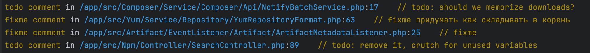
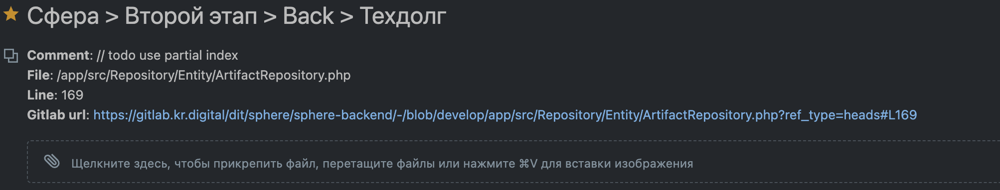
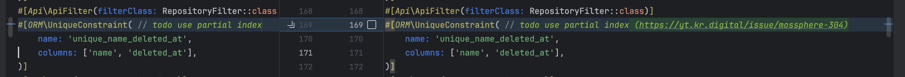
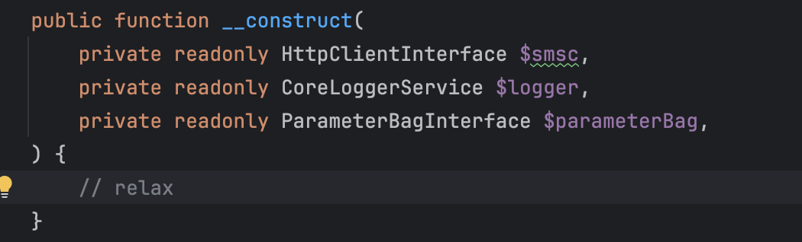
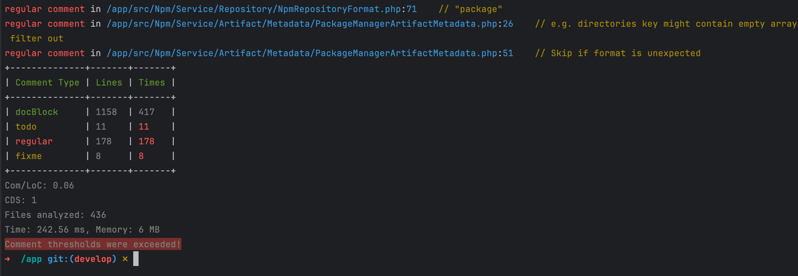

## PHP: управляем комментариями

Существуют десятки инструментов для контроля качества исходного кода, но комментарии в коде зачастую остаются без должного внимания. Например, php-cs-fixer может добавлять лицензии в файлы, исправлять пробелы и следить, чтобы PHPDoc не содержал дублирующей информации. Однако этого далеко не всегда достаточно.

В моей практике возникло несколько кейсов, когда понадобился инструмент, способный делать больше. Расскажу о них ниже.

### 1. Управление техническим долгом

Будучи лидом на проекте, раз в два месяца мне нужно было составлять тикеты на ликвидацию технического долга. Большую часть проблем я, конечно, не помнил, поэтому открывал PHPStorm и через Shift+Shift искал все вхождения TODO и FIXME. Затем вручную добавлял их в тикет.

Такой процесс был неудобным:

* Сложно было убедиться, что ничего не пропущено и не продублировано.

* После закрытия тикета нужно было следить, чтобы соответствующие `TODO` и `FIXME` были убраны.

Вначале я написал простую [утилиту](https://github.com/savinmikhail/Comments-Density), которая находила такие комментарии и выводила их списком в консоль. Это выглядело так:



Но этот процесс всё ещё требовал ручного труда для создания тикетов и проверки удаления комментариев. Захотелось автоматизировать этот процесс.Подключение трекера задачНа проекте использовался YouTrack, и я не нашёл библиотек для работы с его API на PHP. Поэтому я реализовал возможность подключения плагинов, потому что по опыту моего использования нет смысла тащить такую частную логику в общий репозиторий.

```php
<?php

namespace App\Main\Plugin;

use SavinMikhail\CommentsDensity\AnalyzeComments\Analyzer\DTO\Output\CommentDTO;
use SavinMikhail\CommentsDensity\AnalyzeComments\Analyzer\DTO\Output\Report;
use SavinMikhail\CommentsDensity\AnalyzeComments\Comments\FixMeComment;
use SavinMikhail\CommentsDensity\AnalyzeComments\Comments\TodoComment;
use SavinMikhail\CommentsDensity\AnalyzeComments\Config\DTO\Config;
use SavinMikhail\CommentsDensity\AnalyzeComments\File\FileEditor;
use SavinMikhail\CommentsDensity\Plugin\PluginInterface;
use Symfony\Component\HttpClient\HttpClient;
use Symfony\Contracts\HttpClient\HttpClientInterface;

final readonly class OpenIssue implements PluginInterface
{
    private const YOUTRACK_URL = 'https://yt';
    private const AUTHORIZATION_TOKEN = '';
    private const PROJECT_ID = '59-178';
    private const STAGE = 'Второй этап';
    private const BRANCH_NAME = 'develop';
    private const GITLAB_PROJECT_URL = 'https://gitlab/backend';

    public function handle(Report $report, Config $config): void
    {
        $httpClient = HttpClient::create();
        foreach ($report->comments as $comment) {
            if (!in_array($comment->commentType, [TodoComment::NAME, FixMeComment::NAME], true)) {
                continue;
            }

            if ($this->hasIssueUrl($comment->content)) {
                continue;
            }

            $draftId = $this->createDraft($httpClient, $comment);
            $issueId = $this->createIssueFromDraft($httpClient, $draftId);
            $issueUrl = self::YOUTRACK_URL . '/issue/' . $issueId;
            $newComment = new CommentDTO(
                commentType: $comment->commentType,
                commentTypeColor: $comment->commentTypeColor,
                file: $comment->file,
                line: $comment->line,
                content: rtrim($comment->content) . " ($issueUrl)",
            );
            (new FileEditor())->updateCommentInFile($newComment);
        }
    }

    private function buildDescription(CommentDTO $comment): string
    {
        $gitlabUrl = self::GITLAB_PROJECT_URL . '/-/blob/' . self::BRANCH_NAME . $comment->file . '?ref_type=heads#L' . $comment->line;
        return
            "**Comment**: $comment->content \n"
            . "**File**: $comment->file \n"
            . "**Line**: $comment->line \n"
            . "**Gitlab url**: $gitlabUrl \n";
    }

    private function buildSummary(): string
    {
        return 'Сфера > ' . self::STAGE . ' > Back > Техдолг';
    }

    private function createDraft(HttpClientInterface $httpClient, CommentDTO $comment): string
    {
        $response = $httpClient->request(
            'POST',
            self::YOUTRACK_URL . '/api/users/me/drafts?$top=-1&fields=$type,applicableActions(description,executing,id,name,userInputType),attachments($type,author(fullName,id,ringId),comment(id,visibility($type)),created,id,imageDimensions(height,width),issue(id,project(id,ringId),visibility($type)),mimeType,name,removed,size,thumbnailURL,url,visibility($type,implicitPermittedUsers($type,avatarUrl,banBadge,banned,email,fullName,id,isLocked,issueRelatedGroup(icon),login,name,online,profiles(general(trackOnlineStatus)),ringId),permittedGroups($type,allUsersGroup,icon,id,name,ringId),permittedUsers($type,avatarUrl,banBadge,banned,email,fullName,id,isLocked,issueRelatedGroup(icon),login,name,online,profiles(general(trackOnlineStatus)),ringId))),canAddPublicComment,canUpdateVisibility,comments(attachments($type,author(fullName,id,ringId),comment(id,visibility($type)),created,id,imageDimensions(height,width),issue(id,project(id,ringId),visibility($type)),mimeType,name,removed,size,thumbnailURL,url,visibility($type,implicitPermittedUsers($type,avatarUrl,banBadge,banned,email,fullName,id,isLocked,issueRelatedGroup(icon),login,name,online,profiles(general(trackOnlineStatus)),ringId),permittedGroups($type,allUsersGroup,icon,id,name,ringId),permittedUsers($type,avatarUrl,banBadge,banned,email,fullName,id,isLocked,issueRelatedGroup(icon),login,name,online,profiles(general(trackOnlineStatus)),ringId))),id),created,description,externalIssue(key,name,url),fields($type,hasStateMachine,id,isUpdatable,name,projectCustomField($type,bundle(id),canBeEmpty,emptyFieldText,field(fieldType(isMultiValue,valueType),id,localizedName,name,ordinal),id,isEstimation,isPublic,isSpentTime,ordinal,size),value($type,archived,avatarUrl,buildIntegration,buildLink,color(background,id),description,fullName,id,isResolved,localizedName,login,markdownText,minutes,name,presentation,ringId,text)),hasEmail,hiddenAttachmentsCount,id,idReadable,isDraft,links(direction,id,issuesSize,linkType(aggregation,directed,localizedName,localizedSourceToTarget,localizedTargetToSource,name,sourceToTarget,targetToSource,uid),trimmedIssues($type,comments($type),created,id,idReadable,isDraft,numberInProject,project(id,ringId),reporter(id),resolved,summary,voters(hasVote),votes,watchers(hasStar)),unresolvedIssuesSize),mentionedArticles(idReadable,summary),mentionedIssues(idReadable,resolved,summary),mentionedUsers($type,avatarUrl,banBadge,banned,canReadProfile,fullName,id,isLocked,login,name,ringId),messages,numberInProject,project($type,id,isDemo,leader(id),name,plugins(helpDeskSettings(enabled),timeTrackingSettings(enabled,estimate(field(id,name),id),timeSpent(field(id,name),id)),vcsIntegrationSettings(processors(enabled,migrationFailed,server(enabled,url),upsourceHubResourceKey,url))),ringId,shortName,team($type,allUsersGroup,icon,id,name,ringId)),reporter($type,avatarUrl,banBadge,banned,email,fullName,id,isLocked,issueRelatedGroup(icon),login,name,online,profiles(general(trackOnlineStatus)),ringId),resolved,summary,tags(color(id),id,isUpdatable,isUsable,name,owner(id),query),updated,updater($type,avatarUrl,banBadge,banned,email,fullName,id,isLocked,issueRelatedGroup(icon),login,name,online,profiles(general(trackOnlineStatus)),ringId),usesMarkdown,visibility($type,implicitPermittedUsers($type,avatarUrl,banBadge,banned,email,fullName,id,isLocked,issueRelatedGroup(icon),login,name,online,profiles(general(trackOnlineStatus)),ringId),permittedGroups($type,allUsersGroup,icon,id,name,ringId),permittedUsers($type,avatarUrl,banBadge,banned,email,fullName,id,isLocked,issueRelatedGroup(icon),login,name,online,profiles(general(trackOnlineStatus)),ringId)),voters(hasVote),votes,watchers(hasStar),widgets(base,indexPath,place,pluginName)',
            [
                'headers' => [
                    'Content-Type' => 'application/json',
                    'Authorization' => 'Bearer ' . self::AUTHORIZATION_TOKEN,
                ],
                'json' => [
                    'summary' => $this->buildSummary(),
                    'description' => $this->buildDescription($comment),
                    'project' => ['id' => self::PROJECT_ID],
                ],
            ]
        );
        $response = $response->toArray();
        return $response['id']; // looks like 68-107353
    }

    private function createIssueFromDraft(HttpClientInterface $httpClient, string $draftId): string
    {
        $response = $httpClient->request(
            'POST',
            self::YOUTRACK_URL . "/api/issues?draftId={$draftId}&\$top=-1&fields=id,idReadable,numberInProject,messages",
            [
                'headers' => [
                    'Content-Type' => 'application/json',
                    'Authorization' => 'Bearer ' . self::AUTHORIZATION_TOKEN,
                ],
                'json' =>  [
                    'issueId' => $draftId,
                ],
            ]
        );
        $response = $response->toArray();
        return $response['idReadable']; // looks like mossphere-287
    }

    private function hasIssueUrl(string $commentContent): bool
    {
        return (bool)preg_match('/https:\/\/yt\.kr\.digital\/issue\/\w+-\d+/', $commentContent);
    }
}
```

Пример автоматически созданного тикета:



Ссылка на тикет была добавлена к комментарию, что позволяет избежать дублирования задач и посмотреть кто и когда должен это исправить.

Обновление комментария

Можно было бы написать плагин который бы проверял каждый урл на предмет не завершена ли задача и удалять коммент, но мне показалось это оверхедом на данном этапеЕсли ссылка на трекер уже есть в комментарии, то он игнорируется (новый тикет не создастся)

### 2. Борьба с бессмысленными комментариями

На одном проекте мне достался код с бессмысленными комментариями вроде:

Неизвестный разработчик, зачем!?

Такие комментарии не только раздражали, но и мешали линтеру отформатировать код по стандарту PER-CS 2.0.

Для борьбы с этим я добавил поддержку регулярных комментариев (RegularComment) и написал плагин для обработки

```php
<?php

namespace App\Main\Plugin;

use SavinMikhail\CommentsDensity\AnalyzeComments\Analyzer\DTO\Output\CommentDTO;
use SavinMikhail\CommentsDensity\AnalyzeComments\Analyzer\DTO\Output\Report;
use SavinMikhail\CommentsDensity\AnalyzeComments\Comments\RegularComment;
use SavinMikhail\CommentsDensity\AnalyzeComments\Config\DTO\Config;
use SavinMikhail\CommentsDensity\AnalyzeComments\File\FileEditor;
use SavinMikhail\CommentsDensity\Plugin\PluginInterface;

final readonly class RemoveRelaxComment implements PluginInterface
{
    public function handle(Report $report, Config $config): void
    {
        foreach ($report->comments as $comment) {
            if ($comment->commentType !== RegularComment::NAME) {
                continue;
            }

            if (!str_contains($comment->content, '// relax')) {
                continue;
            }

            $newComment = new CommentDTO(
                commentType: $comment->commentType,
                commentTypeColor: $comment->commentTypeColor,
                file: $comment->file,
                line: $comment->line,
                content: '',
            );
            (new FileEditor())->updateCommentInFile($newComment);
        }
    }
}
```

### 3. Отсутствие PHPDoc

На одном проекте стандарт оформления кода требовал обязательного наличия PHPDoc к каждому методу и классу. Я постоянно забывал про это, из-за чего мои МРы часто отклоняли. Чтобы упростить проверку, я добавил тип комментария `MissingDocBlock`, а контроль недостающей документации реализовал через механизм thresholds

### 4. Борьба с поясняющими комментариями

Комментарии, поясняющие код, зачастую являются признаком того, что сам код плохо читается. Хорошо написанный код должен быть самодокументируемым. Инструмент позволяет выявлять такие комментарии и предупреждать разработчиков.Этого можно достигнуть установив лимит на количество regular комментариев, а те, что все-таки нужно оставить можно заигнорировав, добавив в baseline



### 5. Поиск закомментированного кода

В будущем я хочу научить инструмент находить закомментированный код. Такие строки часто забывают удалить, и они засоряют кодовую базу.

### Заключение

Comments Density — это инструмент, который помогает:

* Автоматизировать управление комментариями.

* Сократить технический долг.

* Поддерживать стандарты оформления кода.

Буду рад любой обратной связи :)

Ссылка на репозиторий: [Comments Density](https://github.com/savinmikhail/Comments-Density/tree/main).