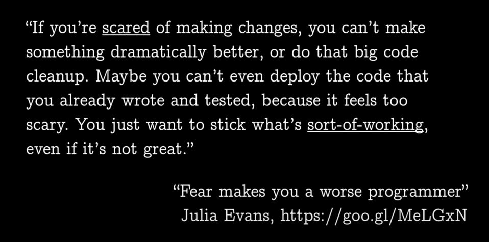

## Вы точно знаете все DD? Погружаемся в мир PDD, HDD, DDD и других!

### Введение

Мотивацией к написанию этой статьи стало великое множество **DD**-подобных аббревиатур.  

Я решил объединить их в одном месте — это может быть полезно как для собеседований, так и для общего развития.  

Статья не претендует на глубину погружения в каждую методологию, а скорее предлагает поверхностный обзор.

Некоторые из них являются антипаттернами (Panic DD, Fear DD)

В связи с этим я привожу их в порядке убывания полезности (на мой взгляд)

---  

### 1. CDD (Comment-Driven Development)

Методология предлагает разработчику перед решением задачи в коде описать подробный алгоритм действий в виде комментария

Что-то вроде
```php
// разбить строку на массив слов
// создать новый массив
// под ключ ложить слово, под значение - единицу
// если ключ уже существует - прибавлять к значению единицу
// вернуть массив
```

### 8. CVDD (CV-Driven Development)
https://rmakara.github.io/Essay-on-benefits-of-CV-driven-development

Идея в том, что вы выбираете технические решения исходя из мотивации усилить свое собственное резюме. 

Конечно это скорее антипаттерн при применении на рабочих проектах, однако для пет проектов - вполне заслуживает внимания. 

Я заводил отдельные проекты только чтобы научиться какому-то навыку, который часто видел в вакансиях, например ElasticSearch

### 2. TDD (Test-Driven Development)

Обычно сначала пишут код, а потом не пишут тесты

Реже бывает, что тесты пишут

Но существует TDD - упрощенно говоря, идея в том, чтобы сначала написать тесты, а потом писать код

Таким образом формируется следующий подход к разарботке:

`Red → Green → Refactor`

Где Red символизирует только что написанный тест, который конечно падает с ошибкой

потом вы пишете реализацию, и тест проходит - green

потом вы рефакторите свой код, и готово - повторять пока фича не будет сделана

По моему опыту этот подход применим только если у вас есть четкое понимание АПИ - вы знаете что должно приходить и что должно отдаваться в ответ.
Например, у меня было тестовое задание написать encryptor/decryptor - подали одни байты, получили другие, сравнили с ожидаемыми.

Вот пример: https://github.com/savinmikhail/encrypting/blob/main/tests/EncryptionTest.php#L17
Чтобы разработать алгоритм, нужно было постоянно проверять, что я иду в нужном направлении, а сверять большое полотно байтов глазами - сомнительная идея. 
Поэтому я написал сначала тесты на все функции шифровщика, а потом уже сделал реализацию

Также это может подойти, если ваш аналитик пишет в задаче не просто "сделай чтоб хорошо было", а прям описывает АПИ как в Сваггере

Если же вы пишете обычные CRUDы то часто там непонятно какие поля будут нужны, сколько их, как будут называться и тп,
то есть проще во время разработки попробовать так и этак, и выбрать подходящий вариант, а потом уже покрыть тестами

### 1. DDD (Domain-Driven Development)

Основные понятия:

- Ubiquitous language - вследствие чего легко сопоставлять действия в коде и действия бизнеса
- Bounded Context
- Выделенный домен (аггрегат) - вследствие чего легко тестировать


Подробнее почитать:

https://habr.com/ru/companies/dododev/articles/489352/

### 3. FDD (Fear-Driven Development)

По большей части это страх менять код

То есть вы пишете костыли, так как боитесь тронуть уже написанный код и все сломать

Такое происходит на проектах, поглощенных техническим долгом, по причине отсутствия тестов в первую очередь,
и различных инструментов статического анализа, которые могут придать вам уверенность в своих действиях



[Здесь](https://habr.com/ru/articles/889120/) я рассказываю, как различные инструменты в CI/CD помогают бороться со страхом что-то сломать

### 9. HDD (Hammock-Driven Development)

Идея в том, что часто решения приходят когда мы не сфокусированы на задаче, а она находится в background нашей головы

https://www.youtube.com/watch?v=f84n5oFoZBc

### 4. ADD (API-Driven Development)
Сначала проектируется АПИ (например в виде open api), а потом уже пишется код

Например:
- аналитик создает вам задачу с уже описанным АПИ, 
- вы имплементируете чей-то существующий АПИ интерфейс (например работа с пактными менеджерами),
- вы договорились с фронтом, что апи будет выглядеть вот так, и вы пошли оба пилить, а не ждете один другого

Подробнее по ссылке:
https://techaffinity.com/blog/api-driven-development/

### 5. BDD (Behavior-Driven Development)

Эта методология рдилась из Test Driven Development, по большей части предлагает более близкий бизнесу язык написания тестов, 
так что новый член команды может понять систему по тестам, а тесты могут писать даже не программисты (в теории)

```text
Feature: Listing command
  In order to change the structure of the folder I am currently in
  As a UNIX user
  I need to be able to see the currently available files and folders there

  Scenario: Listing two files in a directory
    Given I am in a directory "test"
    And I have a file named "foo"
    And I have a file named "bar"
    When I run "ls"
    Then I should get:
      """
      bar
      foo
      """
```

### 7. DDD (Data-Driven Development)

Подход, используемый дизайнерами - собираются метрики действий пользователя на страницах, анализируются, и на основании аналитики улучшается дизайн

### 8. FDD (Feature-Driven Development)
Сделали фичу -> доставили юзеру -> взяли следующую фичу


https://agilemodeling.com/essays/fdd.htm

### 10. MDD (Model-Driven Development)

Instead of relying solely on manual coding, MDD suggests the creation and utilization of domain-specific models that capture the essential structure, 
behavior, and logic of the system. These models, often visual and highly abstract, serve as the primary artifacts from which the final software is derived. 
Domain in this context is any "Process" that need to be modelled and not a business domain.

https://www.linkedin.com/pulse/model-driven-development-strategic-shift-software-vinay-barigidad-wz1of

### 11. NDD (Need-Driven Development)
http://xunitpatterns.com/need-driven%20development.html

### 12. PDD (Puzzle-Driven Development)
https://www.yegor256.com/2010/03/04/pdd.html

### 13. PDD (Panic-Driven Development)

https://habr.com/ru/articles/517540/

### 14. TDD (Type-Driven Development)
https://medium.com/type-driven-systems/type-driven-development-typedriven-systems-fzco-b921423d59a4

---
