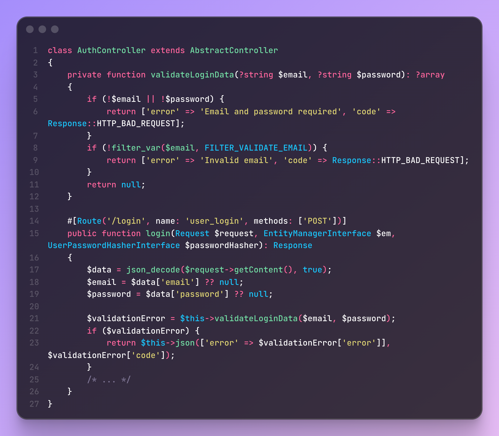
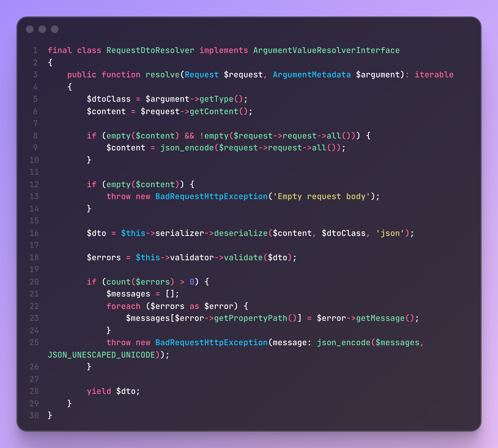
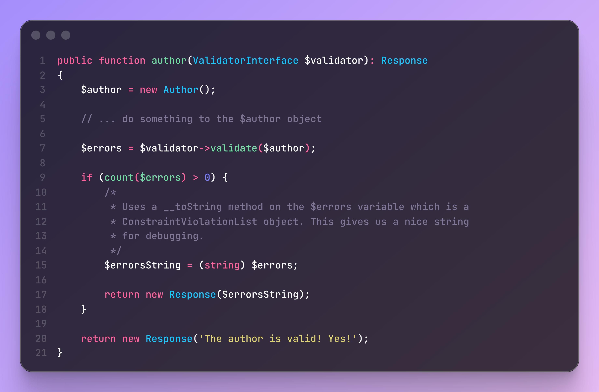
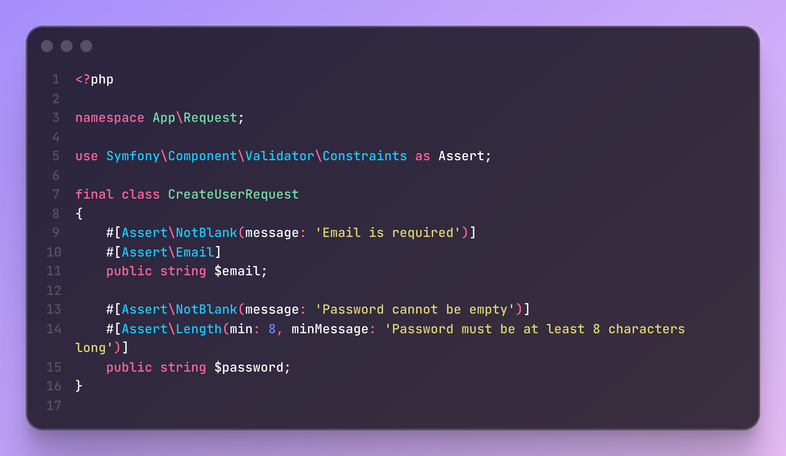
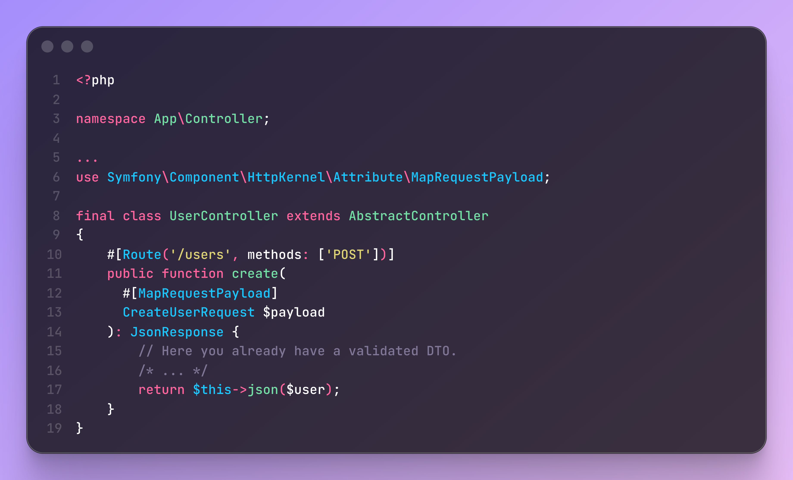
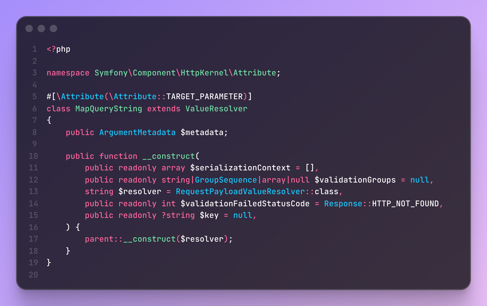
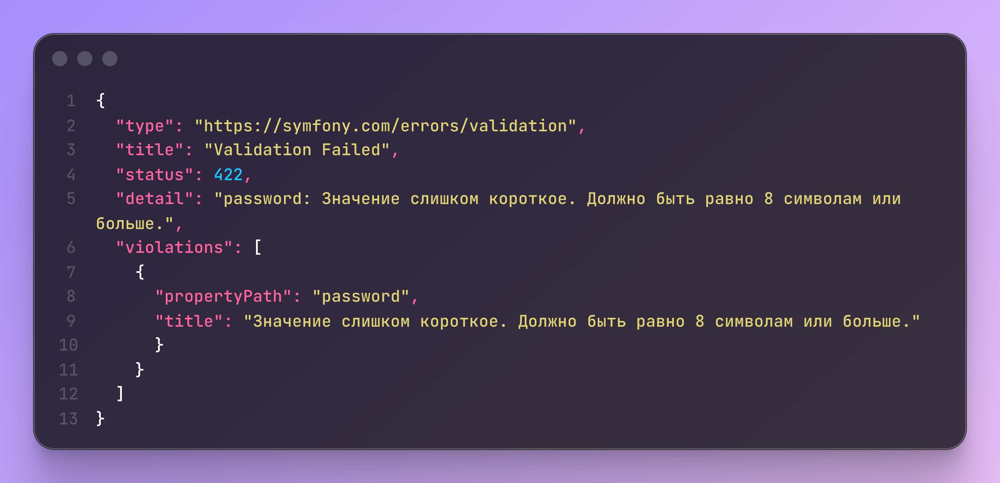

В этом видео я покажу, как буквально **одной строчкой кода** валидировать запросы в Symfony и сразу получать 
аккуратный JSON с ошибками

по моему опыту, большинство новичков делают всё вручную — декодируют Request, пихают данные в DTO через рефлексию, 
сами дергают валидатор и собирают ответ с ошибками.

Большинство примеров в интернете толкают ровно туда же.

Даже в официальной документации примеры с кучей ручного труда.

На деле же Symfony умеет делать все это автоматически.

Для начала, нам нужно создать DTO под реквест и навесить атрибуты валидации на поля:

В контроллере же просто принимаем этот DTO как аргумент метода.

Но Symfony пока не знает, как создать этот объект — и тут мы подсказываем ему через атрибут:
это либо `MapRequestPayload` — для POST, PATCH, PUT запросов.
либо `MapQueryString` — для GET и DELETE.

И **все** на этом, объект уже смаплен и провалидирован.

По умолчанию при провале валидации
 MapRequestPayload вернёт 422 код ответа
А MapQueryString вернёт 404й
Это можно переопределить через аргумент validationFailedStatusCode.

В результате мы имеем вот такой красивый ответ, который фронтендер легко замапит к своим полям:

Теперь у нас меньше кода, меньше багов и чище контроллеры.

Больше разборов — в моём телеграм-канале.

Приятного кодинга
